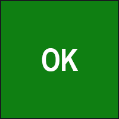
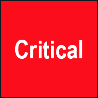
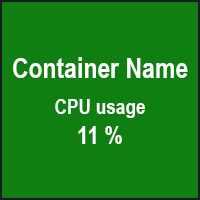
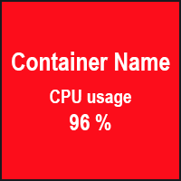

# Grafana Status Panel

> This project was originally contributed by [Vonage](https://github.com/Vonage/Grafana_Status_panel) - thanks for all
> your great work!
>
> The previous published version of the plugin relied on AngularJS which
> is [deprecated](https://grafana.com/docs/grafana/latest/developers/angular_deprecation/). We reached out to Vonage to
> support publishing an updated version based on the changes made in the source repo, but they were unable to pursue
> this
> at the time.
>
> We have stepped up for the time being to minimize disruption, but would be happy to hand maintainership back at any
> point in the future.
>
> We have republished under the same plugin ID, but with the Grafana signature. This means you can simply update your
> plugin version. A new ID would have required manual updates to your dashboards. We changed the signature to Grafana to
> reflect the change in publisher and so that it is clear we are not impersonating the original authors. For additional
> information on the changes, see the [Notices](/NOTICES).

⚠️ This project is not actively maintained by Grafana Labs. Pull requests are welcome and will be reviewed on a
best-effort basis. Contact integrations@grafana.com if you are interested in taking on this project longer term. We will
be happy to work with and eventually hand over to people who are interested in maintaining it again.

This is a plugin meant to be used as a centralized view for the status of component in a glance.
It is very similar to the Single Stat panel, but it can hold multiple values from the same data source.
Each value can be used to customize the panel in different ways:

- Mark the severity of the component
- Mark if the component is disabled
- Show extra data in the panel about the component

## The General Idea

Let's say you want to monitor the healthcheck of an application or a group of containers and want to see the health
status.

This plugin will make it easier to do. You just add a metric or log query and depending on the number obtained, you can
display some thresholds of severity.

You can also personalize the panel to show extra information about the component :

1. Define thresholds - Set the thresholds (if the query value is between), set the severity (like: OK, Warning,
   Critical) and chose a panel color background to represent the severity.
2. Add custom extra information - If you want to show extra information about the component, you can add a title and
   subtitle at the panel (like pod name, app, instance ...).
3. Set flip card - If you want, the panel can flip to show either extra information or severity.
4. Open Link - You can add a link to the panel to redirect the user to a specific page when the panel is clicked.

You can also repeat the panel on a template if you have multiple instances that you want to watch.

## How to install (for debugging purposes only)

1. Copy the contents of "Grafana_Status_panel" to the "/var/lib/grafana/plugins" folder
2. Restart grafana by using `service grafana-server restart`
3. Now this panel should be installed.

## How to use

1. Add the query you want to the panel. Make it to return only number values.
2. Chose the visualization type to be `Status Panel` plugin.
3. Setup Status Panel option in the option container
   - Add a title to the panel (not required)
   - Add a subtitle to the panel (not required)
   - Add a link to the panel (not required)
   - Set the panel border radius (not required, just for style)
   - Set the panel flip card. If you want to flip the panel or stay on a view
4. Setup thresholds in the option container
   - Add a threshold to the panel
   - Set a severity color to this threshold
   - Set a severity name to this threshold
   - set a threshold value
5. Change display option
   - Select the aggregation type (used to calculate the threshold)
   - Select the font type (regular, bold, or italic)
   - Select the unit to be displayed (not required)

## Other Features

### Metric Unit display

You can choose a metric unit to be displayed in the panel. The unit will be displayed next to the metric value.

### Threshold preferences

You can add as much as you need thresholds. You can define threshold preferences like:

- Severity color - Set the color of the panel background when the threshold is reached
- Severity text - Set the text to be displayed when the threshold is reached
- Value threshold - Set the value that will trigger the threshold (computation: `query value >= threshold value`)
  \
  How thresholds works:
  \
  Query value: 68
  \
  Thresholds: Base ; threshold_1: 0 ; threshold_2: 50 ; threshold_3 70 ; threshold_4 90
  \
  The selected threshold is threshold_2, because the query value is between 50 and 70 (query value >= threshold_2 but <
  threshold_3).

### Multi panes in one panel

You can add all you need queries in one panel and each query will be displayed in a pane. Each pane will have the same
thresholds, unit, title, and subtitle.

### Text templating

In fiels 'title', 'subtitle', and 'URL' you can use formatted variables like `{{query_name}}`, `{{query_value}}` ...
Useful when you use multi pane.

List of available template variables:

- `{{query_name}}` - The name of the query (A, B, C ... by default)
- `{{query_value}}` - The value of the query (with aggregation)
- `{{query_index}}` - The positional index of the query (start at 0)
- `{{$__interval}}` - The interval of the query
- `{{time}}` - The time of last sent query (unix timestamp)
- `{{metric_name}}` - (in prometheus) The metric name of the query expression
- `{{label:<label_name>}}` - (in prometheus) The value of the label `<label_name>` of the query expression

### Show disable for no data

If there is no data from any of the metrics, you can show the panel as disabled (in Grey), by checking the
value `Make panel gray when no data` on the top of the options tab

## Supported Data Sources

Maybe all datasources are supported. **Make sure to return number in the query**. You can use some technics to get
number values from string.

## Release Notes

[see release notes](./CHANGELOG.md)

### Upgrading Tips

> ⚠ **Warning**: the version **3.0.0** are breaking changes ! And aren't compatible with the previous versions.

When upgrading there might be some changes in the data the plugin uses and saves, so some of the configurations you made
might be removed by accident.
To prevent this loss of configuration you should save the panel JSON of all panels you have (by exporting the panel or
dashboards) and keep them somewhere safe until you made sure everything is working after the upgrade.

# Screenshots

### Panel States

|       | status OK                     | status Warning                          | status Critical                     |
| :---- | :---------------------------- | :-------------------------------------- | :---------------------------------- |
| front |  |  |  |
| back  |        |        |        |

### Multi panes in one panel

# License

See the [LICENSE](https://github.com/Vonage/Grafana_Status_panel/blob/master/LICENSE.txt) file for license rights and
limitations (Apache License, Version 2.0)
